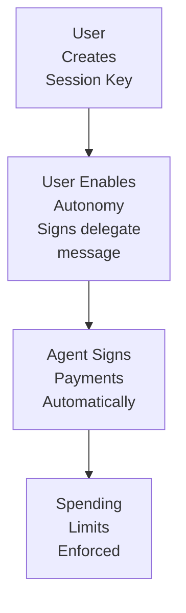

# Autonomous Delegation

Autonomous Delegation enables AI agents to sign transactions on behalf of users without requiring approval for each payment. Users delegate signing authority to session keys with spending limits, and agents can then make payments fully autonomously.

## Overview

Autonomous Delegation is a feature of **Session Keys** that upgrades them from "device-bound" (user must sign each payment) to "autonomous" (agent can sign automatically).

| Device-Bound Session Key | Autonomous Session Key |
|--------------------------|------------------------|
| User signs each payment | Agent signs automatically |
| User must be present | Agent works 24/7 |
| PIN required | No user interaction |
| Moderate friction | Zero friction |

## How It Works




## Prerequisites

1. **Create a device-bound session key first**:

```typescript
import { zendfi } from '@zendfi/sdk';

const sessionKey = await zendfi.sessionKeys.create({
  user_wallet: 'Hx7B...abc',
  limit_usdc: 100,
  duration_days: 7,
  device_fingerprint: 'device_abc123',
});

console.log(`Session Key ID: ${sessionKey.session_key_id}`);
```

2. **Generate and sign delegation message**:

```typescript
// Generate the exact message format
const expiresAt = new Date(Date.now() + 24 * 60 * 60 * 1000).toISOString();
const message = zendfi.autonomy.createDelegationMessage(
  sessionKey.session_key_id,
  100, // $100 max
  expiresAt
);

// User signs this message with their session key
const signature = await signWithSessionKey(message, userPin);
```

3. **Enable autonomous mode**:

```typescript
const delegate = await zendfi.autonomy.enable(sessionKey.session_key_id, {
  max_amount_usd: 100,
  duration_hours: 24,
  delegation_signature: signature,
});

console.log(`Autonomous delegate created:`);
console.log(`  Delegate ID: ${delegate.delegate_id}`);
console.log(`  Max spending: $${delegate.max_amount_usd}`);
console.log(`  Expires: ${delegate.expires_at}`);
```

## Spending Limits

Autonomous delegates have a **total spending limit**, not per-transaction or per-day:

```typescript
const delegate = await zendfi.autonomy.enable(sessionKeyId, {
  max_amount_usd: 100,        // Total $100 can be spent
  duration_hours: 24,         // Valid for 24 hours
  delegation_signature: sig,
});

// After spending $30, remaining is $70
// After spending another $70, delegate is exhausted
```

:::warning
Unlike agent sessions (which have max_per_day, max_per_week, max_per_month), autonomous delegates have a **single total limit** for the entire duration.
:::

## Checking Autonomy Status

```typescript
const status = await zendfi.autonomy.getStatus(sessionKeyId);

if (status.autonomous_mode_enabled && status.delegate) {
  console.log(`Autonomous mode: ACTIVE`);
  console.log(`  Remaining: $${status.delegate.remaining_usd}`);
  console.log(`  Used: $${status.delegate.used_amount_usd}`);
  console.log(`  Limit: $${status.delegate.max_amount_usd}`);
  console.log(`  Expires: ${status.delegate.expires_at}`);
  console.log(`  Active: ${status.delegate.is_active}`);
} else {
  console.log('Autonomous mode not enabled');
}
```

## Agent Making Payments

Once autonomous mode is enabled, payments using this session key are **automatically signed**:

```typescript
// Payment using autonomous session key
const payment = await zendfi.smart.execute({
  session_token: 'session_key_linked_session_token', // If linked to agent session
  agent_id: 'my-agent',
  user_wallet: userWallet,
  amount_usd: 29.99,
});

// With autonomous delegate: requires_signature = false
// Payment is automatically signed by the agent
console.log(`Auto-signed: ${!payment.requires_signature}`);
console.log(`Signature: ${payment.transaction_signature}`);
```

## Revoking Autonomy

Revoke autonomous mode to stop automatic signing:

```typescript
await zendfi.autonomy.revoke(sessionKeyId, 'User requested revocation');

// Future payments will require user signature again
```

:::info
Revoking autonomy does NOT delete the session key. The session key remains valid for device-bound payments (user must sign each transaction).
:::

## Cryptographic Attestations

Every autonomous payment generates a cryptographically signed attestation proving the spending limit was enforced:

```typescript
const audit = await zendfi.autonomy.getAttestations(delegate.delegate_id);

console.log(`Found ${audit.attestation_count} attestations`);
console.log(`ZendFi public key: ${audit.zendfi_attestation_public_key}`);

for (const signed of audit.attestations) {
  const att = signed.attestation;
  
  console.log(`Payment ${att.payment_id}:`);
  console.log(`  Spent before: $${att.spent_usd}`);
  console.log(`  Requested: $${att.requested_usd}`);
  console.log(`  Remaining after: $${att.remaining_after_usd}`);
  console.log(`  Timestamp: ${new Date(att.timestamp_ms)}`);
  console.log(`  Signature: ${signed.signature}`);
  
  // Verify signature independently with nacl.sign.detached.verify()
  // using ZendFi's published public key
}
```

See [Cryptographic Attestations](/agentic/security#cryptographic-attestations) for verification details.

## Lit Protocol Integration

For true serverless autonomy, provide Lit Protocol-encrypted keypair:

```typescript
// Encrypt keypair with Lit Protocol
const litEncrypted = await litClient.encrypt({
  dataToEncrypt: sessionKeypair.secretKey,
  accessControlConditions: [...], // Define access rules
});

// Enable autonomy with Lit encryption
const delegate = await zendfi.autonomy.enable(sessionKeyId, {
  max_amount_usd: 100,
  duration_hours: 24,
  delegation_signature: signature,
  lit_encrypted_keypair: litEncrypted.ciphertext,
  lit_data_hash: litEncrypted.dataToEncryptHash,
});

console.log(`Lit Protocol enabled: ${delegate.lit_protocol_enabled}`);
```

With Lit Protocol, ZendFi can request threshold decryption from Lit nodes to sign transactions autonomously.

## CLI Commands

```bash
# Enable autonomy for a wallet
zendfi autonomy enable \
  --wallet <wallet-address> \
  --agent-id shopping-bot \
  --max-per-day 200 \
  --duration 24

# Check autonomy status
zendfi autonomy status <wallet-address>

# List all delegates
zendfi autonomy delegates --wallet <wallet-address>

# Revoke a delegate
zendfi autonomy revoke <delegate-id>
```

## Complete Example

```typescript
import { zendfi } from '@zendfi/sdk';

// 1. Create session key
const sessionKey = await zendfi.sessionKeys.create({
  user_wallet: userWallet,
  limit_usdc: 100,
  duration_days: 7,
  device_fingerprint: 'device_abc',
});

// 2. User approves spending limit (submit approval transaction)
await zendfi.sessionKeys.submitApproval(sessionKey.session_key_id, {
  signed_transaction: approvalTx,
});

// 3. Generate delegation message
const expiresAt = new Date(Date.now() + 24 * 60 * 60 * 1000).toISOString();
const message = zendfi.autonomy.createDelegationMessage(
  sessionKey.session_key_id,
  100,
  expiresAt
);

// 4. User signs delegation
const signature = await signWithSessionKey(message, userPin);

// 5. Enable autonomous mode
const delegate = await zendfi.autonomy.enable(sessionKey.session_key_id, {
  max_amount_usd: 100,
  duration_hours: 24,
  delegation_signature: signature,
});

console.log(` Autonomous mode enabled!`);
console.log(`   Agent can now spend up to $${delegate.max_amount_usd}`);

// 6. Agent makes payments automatically (no user interaction)
const payment = await zendfi.smart.execute({
  agent_id: 'my-agent',
  user_wallet: userWallet,
  amount_usd: 29.99,
});

console.log(`Payment auto-signed: ${!payment.requires_signature}`);
```

## Error Handling

```typescript
try {
  const delegate = await zendfi.autonomy.enable(sessionKeyId, {
    max_amount_usd: 100,
    duration_hours: 24,
    delegation_signature: signature,
  });
} catch (error) {
  switch (error.code) {
    case 'INVALID_SIGNATURE':
      console.log('Delegation signature is invalid');
      break;
    case 'SESSION_KEY_NOT_FOUND':
      console.log('Session key does not exist');
      break;
    case 'ALREADY_ENABLED':
      console.log('Autonomous mode already enabled for this key');
      break;
    case 'LIMIT_TOO_HIGH':
      console.log('Requested limit exceeds maximum allowed');
      break;
    default:
      console.log('Failed to enable autonomy:', error.message);
  }
}
```

## Security Considerations

1. **Total Limit** - Autonomous delegates have a single total spending limit, not per-day/week/month
2. **Time Bounds** - Delegates automatically expire after duration_hours
3. **Revocation** - Can be revoked immediately at any time
4. **Attestations** - Every payment creates a signed attestation for audit
5. **Lit Protocol** - Optional threshold cryptography for enhanced security

## Comparison: Agent Sessions vs Autonomous Delegation

| Feature | Agent Sessions | Autonomous Delegation |
|---------|---------------|----------------------|
| **Purpose** | Limit agent spending with session tokens | Enable auto-signing with session keys |
| **User Action** | Approve session limits | Sign delegation message |
| **Per Payment** | Pass session_token | No user action |
| **Limits** | Per-transaction, per-day, per-week, per-month | Total spending limit |
| **Signing** | User signs OR custodial/delegate signs | Delegate always signs |
| **Use Case** | Spending control with manual OR auto signing | Fully autonomous payments |

:::tip
You can **combine** both: Create an agent session, link a session key to it, and enable autonomy on that session key. This gives you both session-level limits (day/week/month) AND autonomous signing!
:::

## Best Practices

1. **Start small** - Begin with low max_amount_usd and short duration_hours
2. **Monitor attestations** - Regularly check audit trail with getAttestations()
3. **Use Lit Protocol** - For high-value autonomous operations
4. **Revoke promptly** - Call revoke() when autonomy is no longer needed
5. **Combine with sessions** - Link session keys to agent sessions for layered limits

## Next Steps

- [Session Keys](/agentic/session-keys) - Create and manage session keys
- [Agent Sessions](/agentic/sessions) - Session-level spending limits
- [Security](/agentic/security) - Security best practices