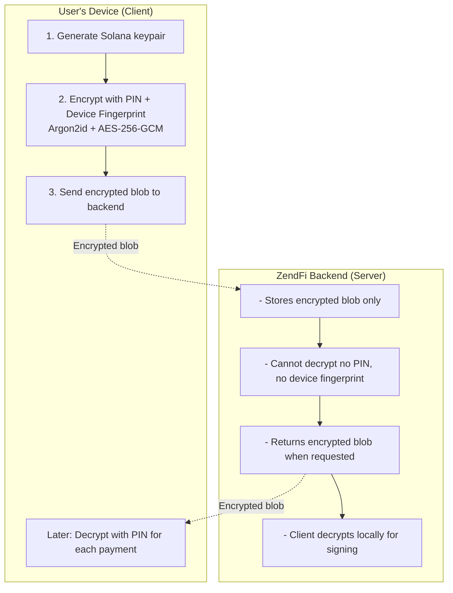

# Device-Bound Session Keys

Device-Bound Session Keys provide truly non-custodial payment sessions where private keys are encrypted client-side with a PIN and never leave the user's device unencrypted. The backend stores only the encrypted blob and cannot decrypt it.

## Overview

**Traditional custodial session keys:**
- Backend holds private keys
- Single point of failure
- Trust required

**Device-Bound Session Keys:**
- Client generates and encrypts keys
- Backend stores encrypted blob only
- PIN + device fingerprint required to decrypt
- Backend **cannot** access private keys

## How It Works



## Creating a Device-Bound Session Key

```typescript
import { zendfi } from '@zendfi/sdk';

// Create a device-bound session key (all-in-one)
const sessionKey = await zendfi.sessionKeys.create({
  pin: '123456',              // 6-digit PIN
  agentId: 'shopping-assistant-v1',  // Required: agent identifier
  agentName: 'AI Shopping Assistant', // Optional: human-readable name
  limitUSDC: 100,             // Spending limit
  durationDays: 7,            // Session duration
  userWallet: 'Hx7B...abc',   // User's main wallet
  generateRecoveryQR: true,   // Enable recovery
});

console.log('Session ID:', sessionKey.sessionKeyId);
console.log('Session Wallet:', sessionKey.sessionWallet);
console.log('Expires:', sessionKey.expiresAt);

// IMPORTANT: Save recovery QR code securely
if (sessionKey.recoveryQR) {
  console.log('Recovery QR:', sessionKey.recoveryQR);
  // Display QR to user or save securely
}
```

## Security Details

### Encryption Algorithm

- **Key Derivation**: Argon2id (OWASP recommended)
  - Memory: 64MB
  - Iterations: 3
  - Parallelism: 4
  - Salt: Device fingerprint

- **Encryption**: AES-256-GCM
  - Nonce: 12 bytes (random per encryption)
  - Tag: 16 bytes (authentication)

### Device Fingerprinting

Generates unique fingerprint from:
- Canvas rendering
- WebGL capabilities
- Audio context
- Screen resolution
- Timezone
- Languages
- Platform
- Hardware concurrency

## Making Payments

### Unlock and Make Payments

```typescript
// Unlock the session key (required before first payment)
await zendfi.sessionKeys.unlock(sessionKey.sessionKeyId, '123456');

// Make a payment
const payment = await zendfi.sessionKeys.makePayment(
  sessionKey.sessionKeyId,
  {
    recipientWallet: 'merchant_wallet_address',
    amountUSD: 29.99,
    description: 'Premium widget purchase',
  }
);

console.log(`Payment ID: ${payment.paymentId}`);
console.log(`Status: ${payment.status}`);
console.log(`Remaining: $${payment.remainingUSDC}`);
```

### Subsequent Payments (Auto-Signing)

```typescript
// After unlock, keypair is cached - no PIN needed!
const payment2 = await zendfi.sessionKeys.makePayment(
  sessionKey.sessionKeyId,
  {
    recipientWallet: 'another_merchant',
    amountUSD: 15.00,
    description: 'Another purchase',
  }
);
// No PIN required - uses cached keypair
);

// Cache expires after 30 minutes (configurable)
```

## Recovery QR Code

If device is lost, use recovery QR to restore session key on new device:

```typescript
// On new device: Scan recovery QR
const recoveryData = 'qr_data_from_scan';

// Re-encrypt with new device fingerprint
const newSessionKey = await DeviceBoundSessionKey.create({
  pin: '123456',              // Same PIN
  limitUSDC: 100,
  durationDays: 7,
  userWallet: 'Hx7B...abc',
  generateRecoveryQR: true,
});

// Register recovery with backend
await manager.recoverSessionKey({
  recoveryQrData: recoveryData,
  newDeviceFingerprint: newSessionKey.getDeviceFingerprint(),
  newEncryptedSessionKey: newSessionKey.getEncryptedData().encryptedData,
  newNonce: newSessionKey.getEncryptedData().nonce,
});
```

## API Methods

### `zendfi.sessionKeys.create(options)`

Create a new device-bound session key.

**Parameters:**
- `pin` (string): 6-digit PIN for encryption
- `agentId` (string): Unique agent identifier
- `agentName` (string, optional): Human-readable agent name
- `limitUSDC` (number): Spending limit in USDC
- `durationDays` (number): Session duration (default: 30)
- `userWallet` (string): User's main wallet address
- `generateRecoveryQR` (boolean, optional): Generate recovery QR code

**Returns:**
```typescript
{
  sessionKeyId: string;
  sessionWallet: string;
  agentId: string;
  limitUSDC: number;
  expiresAt: string;
  isActive: boolean;
  recoveryQR?: string;
}
```

### `zendfi.sessionKeys.load(options)`

Load an existing session key for the same agent.

**Parameters:**
- `userWallet` (string): User's main wallet address
- `agentId` (string): Agent identifier

**Returns:** Same as create()

### `zendfi.sessionKeys.unlock(sessionKeyId, pin)`

Unlock a session key for making payments.

**Parameters:**
- `sessionKeyId` (string): Session key ID
- `pin` (string): 6-digit PIN

### `zendfi.sessionKeys.makePayment(sessionKeyId, payment)`

Make a payment with an unlocked session key.

**Parameters:**
- `sessionKeyId` (string): Session key ID
- `payment` (object):
  - `recipientWallet` (string): Recipient's wallet address
  - `amountUSD` (number): Payment amount in USD
  - `description` (string): Payment description

**Returns:**
```typescript
{
  paymentId: string;
  status: string;
  transactionSignature: string;
  remainingUSDC: number;
}
```

### `zendfi.sessionKeys.getStatus(sessionKeyId)`

Get session key status and balance.

**Returns:**
```typescript
{
  sessionKeyId: string;
  isActive: boolean;
  agentId: string;
  limitUSDC: number;
  usedAmountUSDC: number;
  remainingUSDC: number;
  expiresAt: string;
  daysUntilExpiry: number;
}
```

### `zendfi.sessionKeys.revoke(sessionKeyId)`

Revoke a session key immediately.

Submit client-signed transaction to blockchain.

## Complete Example

```typescript
import { 
  DeviceBoundSessionKey,
  ZendFiSessionKeyManager 
} from '@zendfi/sdk';
import { Connection, Transaction } from '@solana/web3.js';

// Setup
const manager = new ZendFiSessionKeyManager(
  process.env.ZENDFI_API_KEY,
  'https://api.zendfi.tech'
);

// 1. Create session key
const result = await manager.createSessionKey({
  userWallet: '7xKNH6ttXQfJpAoDW1p7zGMKS7kGvXZ4XG7fCcUjU86Y',
  agentId: 'shopping-assistant-v1',
  agentName: 'AI Shopping Assistant',
  limitUSDC: 100,
  durationDays: 7,
  pin: '123456',
  generateRecoveryQR: true,
});

console.log('Session created:', result.sessionKeyId);

// 2. Save recovery QR
if (result.recoveryQR) {
  // Display to user or save securely
  console.log('📱 Save this QR code:', result.recoveryQR);
}

// 3. Create payment intent
const payment = await manager.createPayment({
  sessionKeyId: result.sessionKeyId,
  amountUSD: 25,
  description: 'Coffee',
});

// 4. Get encrypted session key
const encrypted = await manager.getEncryptedSessionKey({
  sessionKeyId: result.sessionKeyId,
  deviceFingerprint: sessionKey.getDeviceFingerprint(),
});

// 5. Decrypt and sign
const sessionKey = await DeviceBoundSessionKey.create({
  pin: '123456',
  // ... original parameters
});

const signedTx = await sessionKey.signTransaction(
  payment.transaction,
  '123456',  // PIN on first use
  true       // Cache for future payments
);

// 6. Submit signed transaction
await manager.submitSignedTransaction({
  paymentId: payment.id,
  signedTransaction: Buffer.from(signedTx.serialize()).toString('base64'),
});

console.log('Payment submitted!');

// 7. Subsequent payments - no PIN needed!
const payment2 = await manager.createPayment({
  sessionKeyId: result.sessionKeyId,
  amountUSD: 15,
  description: 'Snack',
});

// Auto-signing with cached keypair 
const signedTx2 = await sessionKey.signTransaction(payment2.transaction);
```

## Security Best Practices

1. **PIN Requirements**
   - Must be 6 numeric digits
   - Never store PIN on device
   - Prompt user for PIN entry

2. **Recovery QR**
   - Always generate recovery QR
   - Display to user immediately (shown only once)
   - User should save screenshot or print

3. **Cache Management**
   - Default cache TTL: 30 minutes
   - Customize with `cacheTTL` parameter
   - Cache is memory-only (not persisted)

4. **Device Fingerprint**
   - Automatically generated
   - Ties encrypted key to specific device
   - Changes if device configuration changes

5. **Spending Limits**
   - Set conservative limits initially
   - Max limit: $10,000 per session
   - Max duration: 30 days

## Advantages Over Custodial Keys

| Feature | Custodial | Device-Bound |
|---------|-----------|--------------|
| Private key location | Backend server | User's device only |
| Backend can access | Yes | No |
| Requires user action | No | PIN on first use |
| Recovery method | Backend restore | Recovery QR |
| Security model | Trust backend | Zero-trust |
| Regulatory | May require licenses | Non-custodial |

## Error Handling

```typescript
try {
  const signedTx = await sessionKey.signTransaction(tx, pin);
} catch (error) {
  if (error.message.includes('PIN required')) {
    // Cache expired, prompt for PIN
    const newPin = await promptUserForPin();
    const signed = await sessionKey.signTransaction(tx, newPin);
  } else if (error.message.includes('device fingerprint')) {
    // Device changed, need recovery
    console.log('Device mismatch - use recovery QR');
  } else {
    console.error('Signing failed:', error);
  }
}
```

## Next Steps

- [Agent Sessions](/agentic/sessions) - Create spending-limited sessions
- [Autonomous Delegation](/agentic/autonomous-delegation) - Enable autonomous payments
- [Security](/agentic/security) - Security best practices
