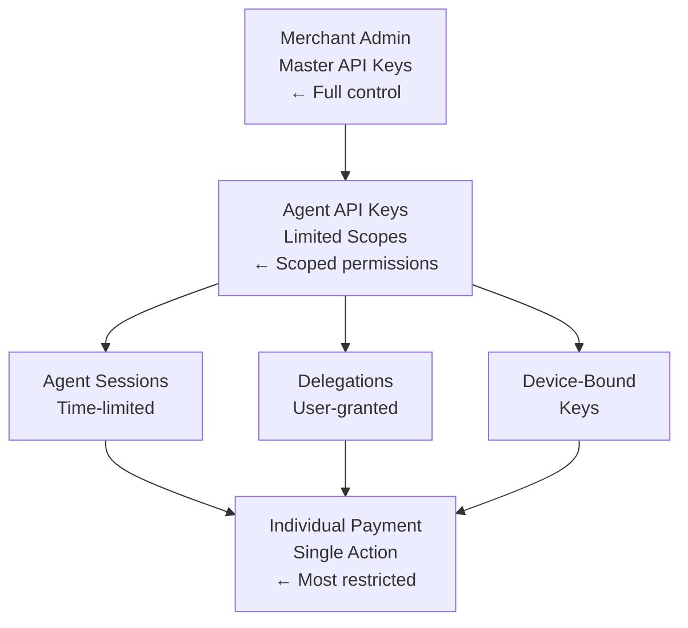
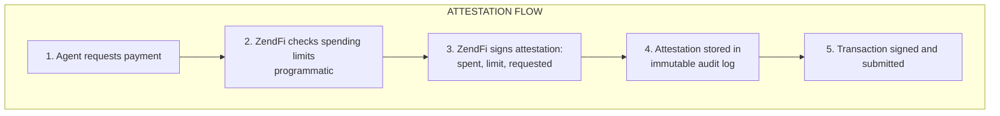

# Security

Comprehensive security guide for implementing agentic payments safely. Learn about permission hierarchies, enforcement mechanisms, and best practices.

## Permission Hierarchy



## API Key Scopes

Always use the minimum required scopes:

| Scope | Capabilities | Risk Level |
|-------|--------------|------------|
| `payments:read` | View payments | Low |
| `payments:write` | Create payments | Medium |
| `intents:read` | View intents | Low |
| `intents:write` | Create/confirm intents | Medium |
| `sessions:read` | View sessions | Low |
| `sessions:write` | Create/manage sessions | Medium |
| `keys:read` | View keys | Low |
| `keys:write` | Create/revoke keys | High |
| `webhooks:read` | View webhooks | Low |
| `webhooks:write` | Configure webhooks | Medium |
| `admin:*` | Full admin access | Critical |

### Creating Scoped Keys

```typescript
import { zendfi } from '@zendfi/sdk';

// Create minimally-scoped key for a shopping agent
const agentKey = await zendfi.admin.createApiKey({
  name: 'Shopping Agent Key',
  scopes: ['payments:write', 'intents:write'],
  rate_limit: {
    requests_per_minute: 60,
    requests_per_day: 1000,
  },
  ip_whitelist: ['192.168.1.0/24'],
  expires_at: '2024-12-31T23:59:59Z',
});
```

## Rate Limiting

Protect against abuse with rate limits:

```typescript
// Configure rate limits per endpoint
const session = await zendfi.agent.createSession({
  agent_id: 'my-agent',
  user_wallet: userWallet,
  rate_limits: {
    payments: {
      per_minute: 10,
      per_hour: 100,
    },
    intents: {
      per_minute: 20,
      per_hour: 200,
    },
  },
});
```

### Rate Limit Headers

All responses include rate limit headers:

```
X-RateLimit-Limit: 60
X-RateLimit-Remaining: 45
X-RateLimit-Reset: 1699999999
```

## Spending Controls

### Session Limits

```typescript
const session = await zendfi.agent.createSession({
  agent_id: 'agent',
  user_wallet: wallet,
  limits: {
    max_per_transaction: 100,    // Single tx limit
    max_per_day: 500,            // Daily limit
    max_per_week: 2000,          // Weekly limit
    max_per_month: 5000,         // Monthly limit
    require_approval_above: 200, // Require approval for large tx
  },
  duration_hours: 24,
  mint_pkp: true, // Enable on-chain enforcement
});
```

### Session Configuration

```typescript
const session = await zendfi.agent.createSession({
  agent_id: 'shopping-agent',
  user_wallet: wallet,
  
  // Spending limits enforced by ZendFi
  limits: {
    max_per_transaction: 50,
    max_per_day: 200,
    max_per_week: 1000,
    max_per_month: 3000,
  },
  
  // Session expiration
  duration_hours: 24,
  
  // On-chain identity (Lit Protocol)
  mint_pkp: true,
});

// Check remaining budget
const status = await zendfi.agent.getSession(session.id);
console.log(`Remaining today: $${status.remaining_today}`);
console.log(`Remaining this week: $${status.remaining_this_week}`);
```

## Key Security

### Device-Bound Keys

Always prefer device-bound keys over file-based:

```typescript
// ✅ Good: Device-bound key
const key = await zendfi.keys.createDeviceBound({
  type: 'webauthn',
  user_verification: 'required',
});

// ❌ Bad: File-based key
const privateKey = fs.readFileSync('key.json'); // Vulnerable
```

### Key Rotation

Rotate keys regularly:

```typescript
// Create new key
const newKey = await zendfi.keys.createDeviceBound({
  name: 'Rotated Key',
  type: 'webauthn',
});

// Migrate permissions
await zendfi.keys.migrate({
  from_key_id: oldKey.id,
  to_key_id: newKey.id,
});

// Revoke old key
await zendfi.keys.revoke(oldKey.id);
```

### MPC for High-Value Operations

```typescript
// Distribute key across Lit Protocol nodes
const mpcKey = await zendfi.keys.createMPC({
  threshold: 2,
  node_count: 3,
  access_control: {
    type: 'multi_condition',
    conditions: [
      { type: 'wallet', wallet: adminWallet },
      { type: 'time', after: '2024-01-01' },
    ],
  },
});
```

## Network Security

### IP Whitelisting

```typescript
const key = await zendfi.admin.createApiKey({
  name: 'Production Key',
  ip_whitelist: [
    '203.0.113.0/24',      // Office network
    '198.51.100.50',       // Production server
  ],
});
```

### mTLS Authentication

For high-security environments:

```typescript
const client = new ZendFiClient({
  api_key: process.env.ZENDFI_API_KEY,
  mtls: {
    cert: fs.readFileSync('client.crt'),
    key: fs.readFileSync('client.key'),
    ca: fs.readFileSync('ca.crt'),
  },
});
```

## Webhook Security

### Signature Verification

Always verify webhook signatures:

```typescript
import { verifyWebhookSignature } from '@zendfi/sdk';

app.post('/webhooks/zendfi', (req, res) => {
  const signature = req.headers['x-zendfi-signature'];
  const timestamp = req.headers['x-zendfi-timestamp'];
  
  const isValid = verifyWebhookSignature({
    payload: req.rawBody,
    signature,
    timestamp,
    secret: process.env.WEBHOOK_SECRET,
    tolerance: 300, // 5 minute tolerance
  });
  
  if (!isValid) {
    return res.status(401).send('Invalid signature');
  }
  
  // Process webhook
  const event = req.body;
  handleEvent(event);
  
  res.status(200).send('OK');
});
```

### Webhook IP Filtering

Only accept webhooks from ZendFi IPs:

```typescript
const ZENDFI_WEBHOOK_IPS = [
  '34.102.136.180',
  '35.186.227.140',
  // Get full list from dashboard
];

app.post('/webhooks/zendfi', (req, res) => {
  const clientIp = req.ip;
  
  if (!ZENDFI_WEBHOOK_IPS.includes(clientIp)) {
    return res.status(403).send('Forbidden');
  }
  
  // Process webhook...
});
```

## Audit Logging

Enable comprehensive audit logging:

```typescript
// All actions are logged automatically
const logs = await zendfi.audit.list({
  start_date: '2024-01-01',
  end_date: '2024-12-31',
  actions: ['payment.created', 'key.used', 'session.created'],
});

logs.forEach(log => {
  console.log(`${log.timestamp}: ${log.action} by ${log.actor}`);
  console.log(`  IP: ${log.ip_address}`);
  console.log(`  Resource: ${log.resource_id}`);
});
```

## Cryptographic Attestations

For autonomous delegation, ZendFi creates cryptographically signed attestations for every payment. These provide an immutable audit trail proving spending limits were enforced correctly.

### How Attestations Work



Each attestation contains:

| Field | Description |
|-------|-------------|
| `spent_usd` | Amount already spent before this payment |
| `limit_usd` | User-defined maximum spending limit |
| `requested_usd` | Amount requested in this payment |
| `remaining_after_usd` | Remaining budget after payment |
| `timestamp_ms` | Attestation creation time |
| `nonce` | Unique ID preventing replay attacks |
| `signature` | Ed25519 signature from ZendFi |

### Fetching Attestations

```typescript
const audit = await zendfi.autonomy.getAttestations(delegateId);

console.log(`ZendFi public key: ${audit.zendfi_attestation_public_key}`);

for (const signed of audit.attestations) {
  const { attestation, signature, signer_public_key } = signed;
  
  console.log(`Payment ${attestation.payment_id}:`);
  console.log(`  Limit: $${attestation.limit_usd}`);
  console.log(`  Spent before: $${attestation.spent_usd}`);
  console.log(`  Requested: $${attestation.requested_usd}`);
  console.log(`  Remaining after: $${attestation.remaining_after_usd}`);
}
```

### Independent Verification

Verify attestation signatures using ZendFi's public key:

```typescript
import nacl from 'tweetnacl';
import bs58 from 'bs58';

function verifyAttestation(signed, zendfiPublicKey) {
  // Decode public key from Base58
  const publicKeyBytes = bs58.decode(zendfiPublicKey);
  
  // Decode signature from Base64
  const signatureBytes = Buffer.from(signed.signature, 'base64');
  
  // Reconstruct signed message (canonical JSON)
  const message = JSON.stringify(signed.attestation);
  const messageBytes = new TextEncoder().encode(message);
  
  // Verify Ed25519 signature
  return nacl.sign.detached.verify(messageBytes, signatureBytes, publicKeyBytes);
}

// Verify all attestations
const audit = await zendfi.autonomy.getAttestations(delegateId);
const pubkey = audit.zendfi_attestation_public_key;

for (const signed of audit.attestations) {
  const valid = verifyAttestation(signed, pubkey);
  console.log(`Payment ${signed.attestation.payment_id}: ${valid ? '✓' : '✗'}`);
}
```

### Security Properties

| Property | Guarantee |
|----------|-----------|
| **Non-repudiation** | ZendFi cannot deny creating the attestation |
| **Tamper-evident** | Any modification invalidates the signature |
| **Replay protection** | Unique nonce per attestation |
| **Time-bound** | Timestamp for chronological ordering |
| **Auditable** | Third parties can verify independently |

### Regulatory Benefits

Attestations strengthen ZendFi's non-MSB (Money Services Business) position:

- **Cryptographic accountability** - Every spending decision is signed
- **User control evidence** - Attestations prove user-defined limits
- **Non-custodial proof** - Demonstrates ZendFi doesn't hold funds
- **Third-party verifiable** - Anyone can audit with the public key

## Fraud Detection

### Velocity Checks

```typescript
const session = await zendfi.agent.createSession({
  agent_id: 'agent',
  user_wallet: wallet,
  
  fraud_detection: {
    enabled: true,
    velocity_threshold: 0.8,  // Flag if 80% of limit used quickly
    suspicious_patterns: [
      'rapid_succession',      // Many tx in short time
      'round_amounts',         // Unusual round amounts
      'new_merchants',         // Payments to new merchants
    ],
    action_on_suspicious: 'flag', // or 'block'
  },
});
```

### Anomaly Alerts

```typescript
// Configure alerts for suspicious activity
await zendfi.alerts.create({
  type: 'spending_anomaly',
  threshold: 2.0,  // 2x normal spending
  notification: {
    email: 'security@company.com',
    webhook: 'https://company.com/alerts',
  },
});
```

## Environment Security

### Secret Management

```typescript
// ✅ Good: Use environment variables or secret managers
const client = new ZendFiClient({
  api_key: process.env.ZENDFI_API_KEY,
});

// ✅ Better: Use a secret manager
import { SecretManagerServiceClient } from '@google-cloud/secret-manager';

const secretClient = new SecretManagerServiceClient();
const [secret] = await secretClient.accessSecretVersion({
  name: 'projects/123/secrets/zendfi-api-key/versions/latest',
});

const client = new ZendFiClient({
  api_key: secret.payload.data.toString(),
});

// ❌ Bad: Hardcoded secrets
const client = new ZendFiClient({
  api_key: 'sk_live_abc123...', // NEVER do this
});
```

### Mode Separation

```typescript
// Use separate keys for test and production
const testClient = new ZendFiClient({
  api_key: process.env.ZENDFI_TEST_KEY,
  mode: 'test',
});

const prodClient = new ZendFiClient({
  api_key: process.env.ZENDFI_LIVE_KEY,
  mode: 'live',
});
```

## Security Checklist

### Before Launch

- [ ] API keys are scoped minimally
- [ ] Rate limits are configured
- [ ] Spending limits are set
- [ ] IP whitelisting is enabled (if applicable)
- [ ] Webhook signatures are verified
- [ ] Device-bound keys are used for signing
- [ ] Audit logging is enabled
- [ ] Test mode is disabled for production

### Ongoing

- [ ] Keys are rotated every 90 days
- [ ] Audit logs are reviewed regularly
- [ ] Spending patterns are monitored
- [ ] Security alerts are configured
- [ ] Dependencies are kept updated

## Incident Response

If you suspect a compromised key:

```typescript
// 1. Immediately revoke the key
await zendfi.keys.revoke(compromisedKeyId);

// 2. Revoke all sessions
await zendfi.sessions.revokeAll({ agent_id: 'compromised-agent' });

// 3. Review audit logs
const logs = await zendfi.audit.list({
  key_id: compromisedKeyId,
  start_date: suspectedCompromiseDate,
});

// 4. Create new key with enhanced security
const newKey = await zendfi.keys.createDeviceBound({
  type: 'webauthn',
  user_verification: 'required',
});
```

## Compliance

### Data Handling

- ZendFi does not store full card numbers
- Wallet addresses are pseudonymous
- All data encrypted at rest (AES-256)
- All data encrypted in transit (TLS 1.3)

### Certifications

- SOC 2 Type II (in progress)
- PCI DSS compliant infrastructure
- GDPR compliant data handling

## Next Steps

- [Agent Keys](/agentic/agent-keys) - API key management
- [Device-Bound Keys](/agentic/device-bound-keys) - Secure key storage
- [Autonomous Delegation](/agentic/autonomous-delegation) - Spending controls
