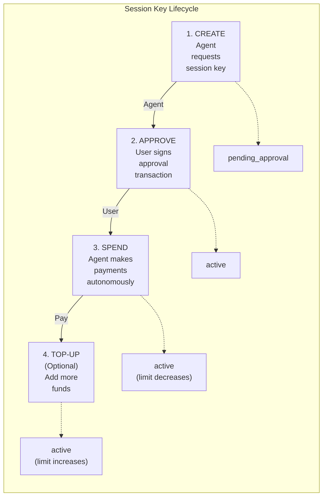

# Session Keys

Session Keys are pre-funded wallets with spending limits that enable AI agents to make autonomous payments without requiring user signatures for each transaction.

## Overview

Session Keys differ from Agent Sessions in a key way:

| Feature | Agent Sessions | Session Keys |
|---------|----------------|--------------|
| **Funding** | Virtual limits on user's wallet | Pre-funded dedicated wallet |
| **User Signature** | Required per payment | One-time approval only |
| **Best For** | Interactive flows | Fully autonomous agents |
| **Agent Scoping** | Agent-specific | Agent-specific (cross-app compatible) |
| **Can Link Together** | Yes | Yes |

:::tip Cross-App Compatibility
**Session keys are agent-scoped**, not merchant-scoped. When a user authorizes a session key for an agent (e.g., "shopping-assistant-v1"), that **same session key works across all apps** using that agent. This eliminates liquidity fragmentation—no more $100 in App A, $100 in App B, $100 in App C for the same agent!
:::

**Note:** Agent Sessions can optionally use Lit Protocol PKPs for on-chain identity when `mint_pkp: true` is set. Session Keys are simpler pre-funded wallets without PKP integration.
:::tip Defense in Depth
For maximum security, **link a session key to a session**. The session key provides signing capability while the session enforces granular spending policies. See [Linking Session Keys to Sessions](#linking-session-keys-to-sessions).
:::

## The Session Key Flow



## Creating a Session Key

```typescript
import { zendfi } from '@zendfi/sdk';

// Create a device-bound session key with PIN encryption
const key = await zendfi.sessionKeys.create({
  userWallet: 'Hx7B...abc',  // Required: user's main wallet
  agentId: 'shopping-assistant-v1',  // Required: unique agent identifier
  agentName: 'AI Shopping Assistant', // Optional: human-readable name
  limitUSDC: 100,           // $100 spending limit
  durationDays: 7,          // Valid for 7 days (default: 30)
  pin: '123456',            // Required: 6-digit PIN for encryption
  generateRecoveryQR: true, // Optional: enable QR recovery
});

console.log(`Session Key ID: ${key.sessionKeyId}`);
console.log(`Session Wallet: ${key.sessionWallet}`);
console.log(`Agent ID: ${key.agentId}`);
console.log(`Limit: $${key.limitUSDC}`);
console.log(`Expires: ${key.expiresAt}`);

// IMPORTANT: Save recovery QR code securely
if (key.recoveryQR) {
  console.log('Recovery QR:', key.recoveryQR);
}
```

### Response Fields

| Field | Description |
|-------|-------------|
| `session_key_id` | Unique identifier for the session key |
| `user_wallet` | User's main wallet address |
| `agent_id` | Agent identifier (e.g., "shopping-assistant-v1") |
| `agent_name` | Human-readable agent name (optional) |
| `limit_usdc` | Maximum spending limit in USDC |
| `expires_at` | Expiration timestamp (ISO 8601) |
| `cross_app_compatible` | Whether key works across multiple apps (true for agent-scoped keys) |
| `requires_approval` | Whether user must sign approval transaction |
| `approval_transaction` | Base64 encoded transaction for user to sign |
| `instructions` | Step-by-step setup instructions |

## Unlocking for Payments

After creating a session key, unlock it with the PIN to enable autonomous payments:

```typescript
// Unlock the session key (required before first payment)
await zendfi.sessionKeys.unlock(key.sessionKeyId, '123456');

// Session key is now ready for payments!
const status = await zendfi.sessionKeys.getStatus(key.sessionKeyId);
console.log(`Remaining: $${status.remainingUSDC}`);
console.log(`Expires: ${status.expiresAt}`);
```

:::tip Auto-Signing After Unlock
After unlocking, the keypair is cached in memory. Subsequent payments don't require the PIN until the process restarts or the session expires.
:::

## Cross-App Behavior

### First App Creates Session Key

```typescript
// App A (Amazon) creates session key
const keyAppA = await zendfi.sessionKeys.create({
  userWallet: 'Hx7B...abc',
  agentId: 'shopping-assistant-v1',
  limitUSDC: 500,
  durationDays: 7,
  pin: '123456',
});

console.log(`Session Key ID: ${keyAppA.sessionKeyId}`);
console.log(`Created new session key with $500 balance`);
// Session key is active immediately after creation
```

### Second App Reuses Existing Session Key

```typescript
// App B (Walmart) loads existing session key for SAME agent
const keyAppB = await zendfi.sessionKeys.load({
  userWallet: 'Hx7B...abc',  // Same user
  agentId: 'shopping-assistant-v1',  // Same agent!
});

console.log(`Session Key ID: ${keyAppB.sessionKeyId}`);
// → Returns SAME session_key_id as App A!

console.log(`Existing Balance: $${keyAppB.remainingUSDC}`);
// → Already approved! No duplicate funding needed.

// App B is automatically authorized to use the existing $500 balance
```

**Result**: User authorizes once, agent works everywhere. No liquidity fragmentation! 🎉

## Checking Session Key Status

```typescript
const status = await zendfi.sessionKeys.getStatus(key.sessionKeyId);

console.log(`Active: ${status.isActive}`);
console.log(`Agent ID: ${status.agentId}`);
console.log(`Limit: $${status.limitUSDC}`);
console.log(`Used: $${status.usedAmountUSDC}`);
console.log(`Remaining: $${status.remainingUSDC}`);
console.log(`Expires: ${status.expiresAt}`);
console.log(`Days until expiry: ${status.daysUntilExpiry}`);

// Security information
if (status.securityStatus) {
  console.log(`Last used: ${status.securityStatus.lastUsedAt}`);
}
```

### Session Key Statuses

Session keys don't have explicit "status" strings. Instead, check:
- `isActive`: Whether the key can be used
- `remainingUSDC > 0`: Whether funds remain
- Compare `expiresAt` with current time for expiration

## Making Payments with Session Keys

Once a session key is active, agents can make payments autonomously:

```typescript
// After unlocking, make autonomous payments
const payment = await zendfi.sessionKeys.makePayment(key.sessionKeyId, {
  recipientWallet: 'merchant_wallet_address',
  amountUSD: 29.99,
  description: 'Premium widget purchase',
});

console.log(`Payment ID: ${payment.paymentId}`);
console.log(`Status: ${payment.status}`);
console.log(`Transaction: ${payment.transactionSignature}`);
console.log(`Remaining: $${payment.remainingUSDC}`);
```

## Revoking a Session Key

Immediately invalidate a session key:

```typescript
await zendfi.sessionKeys.revoke(key.sessionKeyId);
console.log('Session key revoked - no further payments possible');
```

:::warning
Revocation is immediate and irreversible. Any pending payments will fail.
:::

## Listing Session Keys

```typescript
const result = await zendfi.sessionKeys.list();

console.log(`Total: ${result.stats.total_keys}`);
console.log(`Active: ${result.stats.active_keys}`);

result.session_keys.forEach(key => {
  console.log(`${key.session_key_id}:`);
  console.log(`  Active: ${key.is_active}`);
  console.log(`  Remaining: $${key.remaining_usdc}`);
  console.log(`  Expires: ${key.expires_at}`);
});
```

## Session Keys vs Agent Sessions

Choose the right approach for your use case:

### Use Session Keys When:
- Agent operates fully autonomously (no user present)
- You need dedicated pre-funded wallets
- Agent makes frequent payments without user interaction
- Non-custodial security is required

### Use Agent Sessions When:
- User is present and can approve payments
- You want server-side limit enforcement
- Payments go through the user's existing wallet
- You need real-time limit adjustments

## Security Considerations

### Device-Bound Encryption
- Session key private keys are encrypted using AES-256-GCM
- Keys are stored securely in the backend database
- Device fingerprinting adds an extra security layer

### Spending Limits
- Limits are enforced at the protocol level
- Even if agent code is compromised, spending cannot exceed the limit
- Top-ups require explicit user signature

### Expiration
- Session keys auto-expire after the set duration
- Expired keys cannot be used for new payments
- Consider using 7-day durations for most use cases

## Best Practices

1. **Start with low limits** - Begin with $50-100 and increase based on usage
2. **Short durations** - Use 24-hour expiry for most cases
3. **Monitor spending** - Check `getStatus()` before payments
4. **Handle exhaustion** - Prompt user for top-up when limits are low
5. **Revoke unused keys** - Clean up inactive session keys

## API Reference

### Create Session Key

```
POST /api/v1/ai/session-keys/create
```

**Request Body:**
```json
{
  "user_wallet": "Hx7B...abc",
  "agent_id": "shopping-assistant-v1",
  "agent_name": "AI Shopping Assistant",
  "limit_usdc": 100.0,
  "duration_days": 7,
  "device_fingerprint": "device_abc123"
}
```

**Response:**
```json
{
  "session_key_id": "sk_abc123",
  "user_wallet": "Hx7B...abc",
  "agent_id": "shopping-assistant-v1",
  "agent_name": "AI Shopping Assistant",
  "limit_usdc": 100.0,
  "expires_at": "2025-01-01T00:00:00Z",
  "cross_app_compatible": true,
  "requires_approval": true,
  "approval_transaction": "base64_encoded_tx...",
  "instructions": {
    "step_1": "Sign the approval transaction with your wallet",
    "step_2": "Submit the signed transaction using submitApproval()",
    "step_3": "Session key will be active and ready to use"
  }
}
```

**Note:** If a session key already exists for the same `(user_wallet, agent_id)`, the existing session key will be returned with `requires_approval: false` and the current merchant will be automatically authorized to use it.

### Create Device-Bound Session Key

```
POST /api/v1/ai/session-keys/device-bound/create
```

**Request Body:**
```json
{
  "user_wallet": "Hx7B...abc",
  "agent_id": "shopping-assistant-v1",
  "agent_name": "AI Shopping Assistant",
  "encrypted_keypair": "base64_encrypted_data...",
  "session_wallet_address": "9xY...def",
  "nonce": "base64_nonce...",
  "device_fingerprint": "device_abc123",
  "limit_usdc": 100.0,
  "duration_days": 7,
  "recovery_qr_data": "optional_qr_data..."
}
```

## Next Steps

- [Agent Sessions](./sessions) - For interactive payment flows
- [Smart Payments](./smart-payments) - AI-optimized payment execution
- [Autonomous Delegation](./autonomous-delegation) - Alternative for trusted agents
- [Security Best Practices](./security) - Secure your AI payments
- [Helper Utilities](../developer-tools/helper-utilities) - Simplify common patterns
