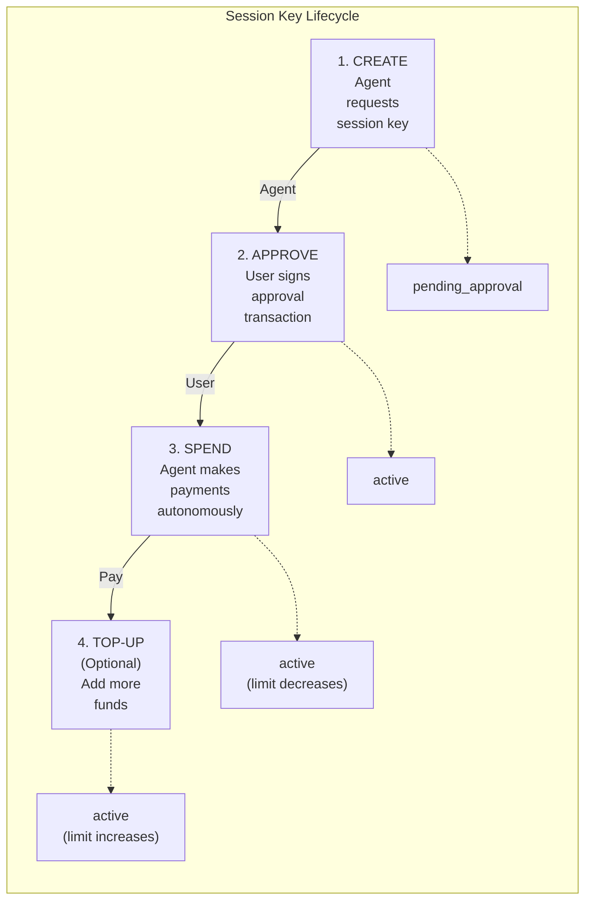
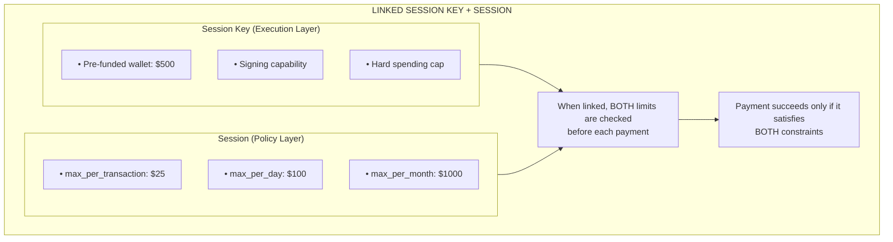

# Session Keys

Session Keys are pre-funded wallets with spending limits that enable AI agents to make autonomous payments without requiring user signatures for each transaction.

## Overview

Session Keys differ from Agent Sessions in a key way:

| Feature | Agent Sessions | Session Keys |
|---------|----------------|--------------|
| **Funding** | Virtual limits on user's wallet | Pre-funded dedicated wallet |
| **User Signature** | Required per payment | One-time approval only |
| **Best For** | Interactive flows | Fully autonomous agents |
| **Agent Scoping** | Agent-specific | Agent-specific (cross-app compatible) |
| **Can Link Together** | Yes | Yes |

:::tip Cross-App Compatibility
**Session keys are agent-scoped**, not merchant-scoped. When a user authorizes a session key for an agent (e.g., "shopping-assistant-v1"), that **same session key works across all apps** using that agent. This eliminates liquidity fragmentation—no more $100 in App A, $100 in App B, $100 in App C for the same agent!
:::

**Note:** Agent Sessions can optionally use Lit Protocol PKPs for on-chain identity when `mint_pkp: true` is set. Session Keys are simpler pre-funded wallets without PKP integration.
:::tip Defense in Depth
For maximum security, **link a session key to a session**. The session key provides signing capability while the session enforces granular spending policies. See [Linking Session Keys to Sessions](#linking-session-keys-to-sessions).
:::

## The Session Key Flow



## Creating a Session Key

```typescript
import { zendfi } from '@zendfi/sdk';

// Step 1: Create a session key
const key = await zendfi.sessionKeys.create({
  user_wallet: 'Hx7B...abc',
  agent_id: 'shopping-assistant-v1',  // Required: unique agent identifier
  agent_name: 'AI Shopping Assistant', // Optional: human-readable name
  limit_usdc: 100,          // $100 spending limit
  duration_days: 7,         // Valid for 7 days (default)
  device_fingerprint: fp,   // Required for security
});

console.log(`Session Key ID: ${key.session_key_id}`);
console.log(`Agent ID: ${key.agent_id}`);
console.log(`Cross-app compatible: ${key.cross_app_compatible}`);
console.log(`Limit: $${key.limit_usdc}`);
console.log(`Expires: ${key.expires_at}`);
```

### Response Fields

| Field | Description |
|-------|-------------|
| `session_key_id` | Unique identifier for the session key |
| `user_wallet` | User's main wallet address |
| `agent_id` | Agent identifier (e.g., "shopping-assistant-v1") |
| `agent_name` | Human-readable agent name (optional) |
| `limit_usdc` | Maximum spending limit in USDC |
| `expires_at` | Expiration timestamp (ISO 8601) |
| `cross_app_compatible` | Whether key works across multiple apps (true for agent-scoped keys) |
| `requires_approval` | Whether user must sign approval transaction |
| `approval_transaction` | Base64 encoded transaction for user to sign |
| `instructions` | Step-by-step setup instructions |

## Submitting User Approval

After creating a session key, the user must sign the approval transaction:

```typescript
// The user's wallet signs the transaction
const signedTx = await userWallet.signTransaction(
  key.approval_transaction
);

// Submit the signed approval
await zendfi.sessionKeys.submitApproval({
  session_key_id: key.session_key_id,
  signed_transaction: signedTx,
});

// Session key is now active!
const status = await zendfi.sessionKeys.getStatus(key.session_key_id);
console.log(`Active: ${status.is_active}`);
```

## Cross-App Behavior

### First App Creates Session Key

```typescript
// App A (Amazon) creates session key
const keyAppA = await zendfi.sessionKeys.create({
  user_wallet: 'Hx7B...abc',
  agent_id: 'shopping-assistant-v1',
  limit_usdc: 500,
  duration_days: 7,
  device_fingerprint: fp,
});

console.log(`Session Key ID: ${keyAppA.session_key_id}`);
console.log(`Requires Approval: ${keyAppA.requires_approval}`); // true
// User signs approval transaction → Session key active with $500
```

### Second App Reuses Existing Session Key

```typescript
// App B (Walmart) tries to create session key for SAME agent
const keyAppB = await zendfi.sessionKeys.create({
  user_wallet: 'Hx7B...abc',  // Same user
  agent_id: 'shopping-assistant-v1',  // Same agent!
  limit_usdc: 500,  // Ignored - uses existing limit
  duration_days: 7,
  device_fingerprint: fp,
});

console.log(`Session Key ID: ${keyAppB.session_key_id}`);
// → Returns SAME session_key_id as App A!

console.log(`Requires Approval: ${keyAppB.requires_approval}`); // false
// → Already approved! No duplicate funding needed.

// App B is automatically authorized to use the existing $500 balance
```

**Result**: User authorizes once, agent works everywhere. No liquidity fragmentation! 🎉

## Checking Session Key Status

```typescript
const status = await zendfi.sessionKeys.getStatus(key.session_key_id);

console.log(`Active: ${status.is_active}`);
console.log(`Approved: ${status.is_approved}`);
console.log(`Agent ID: ${status.agent_id}`);
console.log(`Limit: $${status.limit_usdc}`);
console.log(`Used: $${status.used_amount_usdc}`);
console.log(`Remaining: $${status.remaining_usdc}`);
console.log(`Expires: ${status.expires_at}`);
console.log(`Days until expiry: ${status.days_until_expiry}`);

// Security information
if (status.security_status) {
  console.log(`Device matched: ${status.security_status.device_fingerprint_matched}`);
  console.log(`Last used: ${status.security_status.last_used_at}`);
}
```

### Session Key Statuses

Session keys don't have explicit "status" strings. Instead, check:
- `is_active`: Whether the key can be used
- `is_approved`: Whether the approval transaction was confirmed
- `remaining_usdc > 0`: Whether funds remain
- Compare `expires_at` with current time for expiration

## Making Payments with Session Keys

Once a session key is active, agents can make payments autonomously:

```typescript
// Use the smart payment endpoint with session context
const payment = await zendfi.smart.execute({
  agent_id: 'shopping-assistant',
  user_wallet: key.session_key_address,  // Use session key address
  amount_usd: 29.99,
  description: 'Premium widget',
  auto_detect_gasless: true,
});

console.log(`Payment ID: ${payment.payment_id}`);
console.log(`Status: ${payment.status}`);
console.log(`Transaction: ${payment.transaction_signature}`);
```

## Topping Up a Session Key

Add more funds to an existing session key:

```typescript
// Step 1: Request a top-up
const topUp = await zendfi.sessionKeys.topUp(key.session_key_id, {
  user_wallet: 'Hx7B...abc',
  amount_usdc: 50,          // Add $50 more
  device_fingerprint: fp,
});

console.log(`Previous limit: $${topUp.previous_limit}`);
console.log(`New limit: $${topUp.new_limit}`);
console.log(`Added: $${topUp.added_amount}`);

// Step 2: User signs the top-up transaction
const signedTopUp = await userWallet.signTransaction(
  topUp.top_up_transaction
);

// Step 3: Submit the signed top-up
await zendfi.sessionKeys.submitTopUp(
  key.session_key_id,
  signedTopUp
);

// Verify the new limit
const updated = await zendfi.sessionKeys.getStatus(key.session_key_id);
console.log(`Updated limit: $${updated.limit_usdc}`);
```

## Revoking a Session Key

Immediately invalidate a session key:

```typescript
await zendfi.sessionKeys.revoke(key.session_key_id);
console.log('Session key revoked - no further payments possible');
```

:::warning
Revocation is immediate and irreversible. Any pending payments will fail.
:::

## Listing Session Keys

```typescript
const result = await zendfi.sessionKeys.list();

console.log(`Total: ${result.stats.total_keys}`);
console.log(`Active: ${result.stats.active_keys}`);

result.session_keys.forEach(key => {
  console.log(`${key.session_key_id}:`);
  console.log(`  Active: ${key.is_active}`);
  console.log(`  Remaining: $${key.remaining_usdc}`);
  console.log(`  Expires: ${key.expires_at}`);
});
```

## Linking Session Keys to Sessions

For **defense in depth**, you can link a session key to an AI session. This provides two layers of protection:

1. **Session Key Balance** - Hard cap on total spending (what's funded)
2. **Session Policy Limits** - Granular limits (per-tx, daily, weekly, monthly)



### Linking a Session Key to a Session

```typescript
// 1. Create a session with granular limits
const session = await zendfi.agent.createSession({
  agent_id: 'shopping-bot',
  user_wallet: userWallet,
  limits: {
    max_per_transaction: 25,   // $25 max per payment
    max_per_day: 100,          // $100 daily limit
    max_per_month: 1000,       // $1000 monthly limit
  },
  duration_hours: 168,  // 7 days
});

// 2. Create and fund a session key
const key = await zendfi.sessionKeys.create({
  user_wallet: userWallet,
  limit_usdc: 500,  // Fund with $500
  duration_days: 7,
  device_fingerprint: fp,
});

// User approves...
await zendfi.sessionKeys.submitApproval(key.session_key_id, { signed_transaction: signedTx });

// 3. Link them together
await zendfi.sessionKeys.linkSession(key.session_key_id, session.id);

// Now payments will check BOTH:
// - Session key balance ($500 funded)
// - Session limits ($25 per tx, $100 per day)
```

### Pre-Checking Payment Affordability

Before making a payment, check if it's allowed:

```typescript
const check = await zendfi.sessionKeys.canAfford(key.session_key_id, 50);

if (check.allowed) {
  console.log(`Payment allowed. Effective limit: $${check.effective_limit}`);
  // Proceed with payment...
} else {
  console.log(`Payment blocked: ${check.reason}`);
  console.log(`Session key remaining: $${check.session_key_remaining}`);
  console.log(`Session remaining today: $${check.session_remaining_today}`);
}
```

### Unlinking a Session

If you need to remove the policy layer:

```typescript
await zendfi.sessionKeys.unlinkSession(key.session_key_id);
// Now only session key balance limits apply
```

### Why Link Them?

| Scenario | Session Key Only | Linked |
|----------|------------------|--------|
| Agent tries $500 payment |  Allowed (has balance) | Blocked (exceeds $25 per-tx limit) |
| Agent makes 5x $50 payments/day |  Allowed ($250 total) | Blocked after 2nd (exceeds $100/day) |
| Compromised agent tries to drain | Can spend full $500 | Capped at policy limits |

**Recommendation:** Always link session keys to sessions for production AI agents.

## Session Keys vs Agent Sessions

Choose the right approach for your use case:

### Use Agent Sessions When:
- User is present and can approve payments
- You want server-side limit enforcement
- Payments go through the user's existing wallet
- You need real-time limit adjustments

### Use Session Keys When:
- Agent operates fully autonomously (no user present)
- You need dedicated pre-funded wallets
- You want on-chain identity (PKP) for every session
- Agent makes frequent payments without user interaction

## Security Considerations

### Encrypted Storage
- Session key private keys are encrypted using AES-256-GCM
- Keys are stored securely in the backend database
- Device fingerprinting adds an extra security layer

### Spending Limits
- Limits are enforced at the protocol level
- Even if agent code is compromised, spending cannot exceed the limit
- Top-ups require explicit user signature

### Expiration
- Session keys auto-expire after the set duration
- Expired keys cannot be used for new payments
- Consider using 7-day durations for most use cases

## Best Practices

1. **Start with low limits** - Begin with $50-100 and increase based on usage
2. **Short durations** - Use 24-hour expiry for most cases
3. **Monitor spending** - Check `getStatus()` before payments
4. **Handle exhaustion** - Prompt user for top-up when limits are low
5. **Revoke unused keys** - Clean up inactive session keys

## API Reference

### Create Session Key

```
POST /api/v1/ai/session-keys/create
```

**Request Body:**
```json
{
  "user_wallet": "Hx7B...abc",
  "agent_id": "shopping-assistant-v1",
  "agent_name": "AI Shopping Assistant",
  "limit_usdc": 100.0,
  "duration_days": 7,
  "device_fingerprint": "device_abc123"
}
```

**Response:**
```json
{
  "session_key_id": "sk_abc123",
  "user_wallet": "Hx7B...abc",
  "agent_id": "shopping-assistant-v1",
  "agent_name": "AI Shopping Assistant",
  "limit_usdc": 100.0,
  "expires_at": "2025-01-01T00:00:00Z",
  "cross_app_compatible": true,
  "requires_approval": true,
  "approval_transaction": "base64_encoded_tx...",
  "instructions": {
    "step_1": "Sign the approval transaction with your wallet",
    "step_2": "Submit the signed transaction using submitApproval()",
    "step_3": "Session key will be active and ready to use"
  }
}
```

**Note:** If a session key already exists for the same `(user_wallet, agent_id)`, the existing session key will be returned with `requires_approval: false` and the current merchant will be automatically authorized to use it.

### Create Device-Bound Session Key

```
POST /api/v1/ai/session-keys/device-bound/create
```

**Request Body:**
```json
{
  "user_wallet": "Hx7B...abc",
  "agent_id": "shopping-assistant-v1",
  "agent_name": "AI Shopping Assistant",
  "encrypted_keypair": "base64_encrypted_data...",
  "session_wallet_address": "9xY...def",
  "nonce": "base64_nonce...",
  "device_fingerprint": "device_abc123",
  "limit_usdc": 100.0,
  "duration_days": 7,
  "recovery_qr_data": "optional_qr_data..."
}
```

## Next Steps

- [Agent Sessions](./sessions) - For interactive payment flows
- [Smart Payments](./smart-payments) - AI-optimized payment execution
- [Autonomous Delegation](./autonomous-delegation) - Alternative for trusted agents
- [Security Best Practices](./security) - Secure your AI payments
- [Helper Utilities](../developer-tools/helper-utilities) - Simplify common patterns
