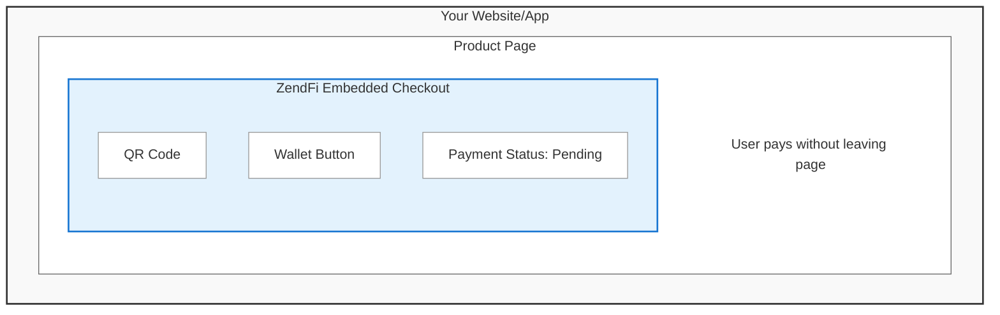

# Embedded Checkout

Accept crypto payments directly in your website or app—no redirects, no pop-ups, just native integration. Your users never leave your page.

## How It Works



**Traditional Flow:**
1. User clicks "Buy Now"
2. Redirect to checkout.zendfi.tech
3. User completes payment
4. Redirect back to your site
5. ❌ Broken back buttons, lost context

**Embedded Flow:**
1. User clicks "Buy Now"
2. Checkout appears inline
3. User completes payment
4. Success callback fires
5. Seamless experience, no redirects


## When to Use

| Use Case | Best Choice |
|----------|-------------|
| **Product pages** | Embedded Checkout |
| **Shopping cart** | Embedded Checkout |
| **Quick purchases** | Embedded Checkout |
| **Email payments** | Payment Links (redirect) |
| **Social sharing** | Payment Links (redirect) |
| **Invoice payments** | Either works |

**Rule of thumb:** If the user is already on your website/app, use embedded checkout. For links shared externally, use payment links.


## Quick Start

### 1. Install the SDK

```bash
npm install @zendfi/sdk
```

### 2. Create a Payment Link

Payment links work for both hosted checkout AND embedded checkout:

```typescript
// Server-side (Node.js, Next.js API route, etc.)
import { ZendFiClient } from '@zendfi/sdk';

const client = new ZendFiClient({
  apiKey: process.env.ZENDFI_API_KEY,
  mode: 'live', // or 'test' for development
});

const link = await client.createPaymentLink({
  amount: 50.00,
  currency: 'USD',
  token: 'USDC',
  description: 'Premium Subscription - Monthly',
});

// Return link_code to frontend
return { linkCode: link.link_code };
```

:::tip Why Payment Links?
Payment links are reusable and work for both hosted and embedded checkout. You don't need separate APIs, just choose how to present the checkout to your user.
:::

### 3. Embed the Checkout

```typescript
// Client-side (browser)
import { ZendFiEmbeddedCheckout } from '@zendfi/sdk';

// Get link code from your backend
const response = await fetch('/api/create-checkout', {
  method: 'POST',
  body: JSON.stringify({ amount: 50 }),
});
const { linkCode } = await response.json();

// Initialize embedded checkout
const checkout = new ZendFiEmbeddedCheckout({
  linkCode: linkCode,
  containerId: 'checkout-container', // HTML element ID
  mode: 'live',
  
  onSuccess: (payment) => {
    console.log('Payment successful!', payment);
    // Show success message, unlock features, etc.
  },
  
  onError: (error) => {
    console.error('Payment failed:', error);
    // Show error message
  },
});

// Mount the checkout UI
await checkout.mount();
```

### 4. Add HTML Container

```html
<div id="checkout-container"></div>
```

That's it! The checkout will render inside the container with full functionality.


## API Reference

### ZendFiEmbeddedCheckout Options

```typescript
interface EmbeddedCheckoutOptions {
  // Required
  linkCode: string;              // From createPaymentLink()
  containerId: string;           // HTML element ID to mount into
  mode: 'live' | 'test';         // Environment mode
  
  // Callbacks
  onSuccess?: (payment: PaymentSuccess) => void;
  onError?: (error: CheckoutError) => void;
  onLoad?: () => void;
  onStatusChange?: (status: PaymentStatus) => void;
  
  // Customization
  theme?: CheckoutTheme;
  paymentMethods?: PaymentMethodsConfig;
  locale?: string;               // e.g., 'en-US', 'es-ES'
}
```

### PaymentSuccess Object

When payment completes, your `onSuccess` callback receives:

```typescript
interface PaymentSuccess {
  paymentId: string;              // UUID from database
  transactionSignature: string;   // Solana transaction hash
  amount: number;                 // Payment amount in USD
  token: string;                  // Token used (USDC, SOL, etc.)
  merchantName: string;           // Your business name
}
```

### CheckoutTheme

Customize the checkout UI to match your brand:

```typescript
interface CheckoutTheme {
  primaryColor?: string;          // Buttons and accents
  backgroundColor?: string;       // Card background
  textColor?: string;             // Primary text color
  borderRadius?: string;          // Corner rounding (px)
  fontFamily?: string;            // Font stack
  buttonStyle?: 'solid' | 'outlined' | 'minimal';
}
```

### PaymentMethodsConfig

Control which payment methods to show:

```typescript
interface PaymentMethodsConfig {
  qrCode?: boolean;               // Show QR code for mobile wallets
  walletConnect?: boolean;        // Show wallet connection buttons
  wallets?: string[];             // Specific wallets to show
                                  // ['phantom', 'solflare', 'backpack']
}
```


## Full Example: Product Purchase

```typescript
// pages/products/[id].tsx
import { ZendFiEmbeddedCheckout } from '@zendfi/sdk';
import { useState, useEffect } from 'react';

export default function ProductPage({ product }) {
  const [checkoutVisible, setCheckoutVisible] = useState(false);
  
  async function handleBuyNow() {
    // Create payment link on backend
    const response = await fetch('/api/create-checkout', {
      method: 'POST',
      headers: { 'Content-Type': 'application/json' },
      body: JSON.stringify({
        amount: product.price,
        description: product.name,
      }),
    });
    
    const { linkCode } = await response.json();
    
    // Show checkout container
    setCheckoutVisible(true);
    
    // Initialize embedded checkout
    const checkout = new ZendFiEmbeddedCheckout({
      linkCode,
      containerId: 'checkout-container',
      mode: 'live',
      
      onSuccess: async (payment) => {
        // Hide checkout
        setCheckoutVisible(false);
        
        // Show success message
        alert(`Payment successful! Transaction: ${payment.transactionSignature}`);
        
        // Update your database, unlock content, etc.
        await fetch('/api/orders', {
          method: 'POST',
          body: JSON.stringify({
            productId: product.id,
            paymentId: payment.paymentId,
          }),
        });
      },
      
      onError: (error) => {
        console.error('Payment error:', error);
        alert(`Payment failed: ${error.message}`);
      },
      
      theme: {
        primaryColor: '#0066ff',
        borderRadius: '12px',
        fontFamily: 'Inter, sans-serif',
      },
    });
    
    await checkout.mount();
  }
  
  return (
    <div>
      <h1>{product.name}</h1>
      <p>${product.price}</p>
      
      
      <button onClick={handleBuyNow}>
        Buy Now
      </button>
      
      {checkoutVisible && (
        <div id="checkout-container" style={{ marginTop: '2rem' }}></div>
      )}
    </div>
  );
}
```


## Customization Examples

### Minimal Theme

```typescript
theme: {
  primaryColor: '#000000',
  backgroundColor: '#ffffff',
  borderRadius: '4px',
  buttonStyle: 'minimal',
}
```

### Dark Theme

```typescript
theme: {
  primaryColor: '#3b82f6',
  backgroundColor: '#1a1a1a',
  textColor: '#ffffff',
  borderRadius: '8px',
  buttonStyle: 'outlined',
}
```

### Brand Colors

```typescript
theme: {
  primaryColor: '#ff0080',        // Your brand color
  backgroundColor: '#fafafa',
  borderRadius: '16px',
  fontFamily: 'Roboto, sans-serif',
  buttonStyle: 'solid',
}
```

### Mobile-Only QR Code

```typescript
paymentMethods: {
  qrCode: true,      // Show QR code
  walletConnect: false, // Hide wallet buttons
}
```

### Specific Wallets Only

```typescript
paymentMethods: {
  qrCode: true,
  walletConnect: true,
  wallets: ['phantom', 'backpack'], // Only show these wallets
}
```


## Advanced Features

### Status Updates

Track payment status in real-time:

```typescript
const checkout = new ZendFiEmbeddedCheckout({
  linkCode,
  containerId: 'checkout-container',
  mode: 'live',
  
  onStatusChange: (status) => {
    console.log('Payment status:', status);
    // status: 'pending' | 'processing' | 'confirmed' | 'failed'
    
    if (status === 'processing') {
      showSpinner();
    }
  },
});
```

### Custom Amount Input

Let users choose how much to pay:

```typescript
// Backend: Create payment link with custom amount enabled
const link = await client.createPaymentLink({
  amount: 20.00,              // Suggested amount
  allow_custom_amount: true,
  minimum_amount: 5.00,
  maximum_amount: 1000.00,
  currency: 'USD',
  token: 'USDC',
});

// Frontend: Embedded checkout will show amount input automatically
```

### Multiple Tokens

Let customers choose their preferred token:

```typescript
// Backend: Create separate links for each token
const usdcLink = await client.createPaymentLink({
  amount: 50,
  token: 'USDC',
  description: 'Premium Plan',
});

const solLink = await client.createPaymentLink({
  amount: 50,
  token: 'SOL',
  description: 'Premium Plan',
});

// Frontend: Show token selector
<select onChange={(e) => loadCheckout(e.target.value)}>
  <option value={usdcLink.link_code}>Pay with USDC</option>
  <option value={solLink.link_code}>Pay with SOL</option>
</select>
```

### React Component Wrapper

```typescript
// components/EmbeddedCheckout.tsx
import { useEffect, useRef } from 'react';
import { ZendFiEmbeddedCheckout } from '@zendfi/sdk';

export function EmbeddedCheckout({ 
  linkCode, 
  onSuccess, 
  onError 
}: {
  linkCode: string;
  onSuccess: (payment: any) => void;
  onError: (error: any) => void;
}) {
  const containerRef = useRef<HTMLDivElement>(null);
  const checkoutRef = useRef<ZendFiEmbeddedCheckout | null>(null);
  
  useEffect(() => {
    if (!containerRef.current || !linkCode) return;
    
    const checkout = new ZendFiEmbeddedCheckout({
      linkCode,
      containerId: containerRef.current.id,
      mode: 'live',
      onSuccess,
      onError,
    });
    
    checkout.mount();
    checkoutRef.current = checkout;
    
    return () => {
      // Cleanup on unmount
      checkoutRef.current?.destroy();
    };
  }, [linkCode, onSuccess, onError]);
  
  return <div id="zendfi-checkout" ref={containerRef} />;
}

// Usage:
<EmbeddedCheckout
  linkCode={linkCode}
  onSuccess={(payment) => console.log('Success!', payment)}
  onError={(error) => console.error('Error:', error)}
/>
```


## Security Best Practices

### DO

- **Create payment links on your backend** - Never expose API keys in frontend code
- **Use test mode during development** - Test keys are safe for browser use
- **Validate webhook signatures** - Verify events from ZendFi are authentic
- **Store payment IDs in your database** - Track orders and prevent duplicates
- **Use HTTPS in production** - Embedded checkout requires secure origin

### DON'T

- **Never put production API keys in frontend** - `zfi_live_` keys must stay server-side
- **Don't trust frontend-only validation** - Always verify payments via webhooks or backend
- **Don't skip HTTPS in production** - Browsers block insecure payment flows
- **Don't rely only on onSuccess callbacks** - Use webhooks for authoritative payment confirmation


## Browser Support

| Browser | Version | Support |
|---------|---------|---------|
| Chrome | 90+ | Full |
| Firefox | 88+ | Full |
| Safari | 14+ | Full |
| Edge | 90+ | Full |
| Mobile Safari | 14+ | Full |
| Mobile Chrome | 90+ | Full |

**Requirements:**
- ES modules support
- Fetch API
- Promises/async-await
- Web Crypto API (for wallet connections)


## Troubleshooting

### Checkout Doesn't Render

**Problem:** Nothing appears in the container.

**Solutions:**
1. Check that the container element exists: `document.getElementById('your-container-id')`
2. Verify `linkCode` is valid (not undefined or empty)
3. Check browser console for errors
4. Ensure SDK is loaded: `import { ZendFiEmbeddedCheckout } from '@zendfi/sdk'`

### CORS Errors

**Problem:** `Origin X is not allowed by Access-Control-Allow-Origin`

**Solutions:**
1. Don't open HTML files directly (`file://` protocol) - use HTTP server
2. Use our test server: Create `serve.mjs`:
   ```javascript
   import http from 'http';
   import fs from 'fs';
   
   http.createServer((req, res) => {
     const html = fs.readFileSync('index.html', 'utf8');
     res.writeHead(200, { 'Content-Type': 'text/html' });
     res.end(html);
   }).listen(8080);
   ```
   Run: `node serve.mjs`

### Payment Not Confirming

**Problem:** Payment stuck in "Processing" status.

**Solutions:**
1. Check Solana network status: [status.solana.com](https://status.solana.com)
2. Verify wallet has sufficient funds (including gas fees)
3. Confirm correct network (devnet vs mainnet)
4. Check transaction on Solana explorer

### onSuccess Fires Multiple Times

**Problem:** Success callback triggers more than once.

**Solution:** Update to SDK v0.7.3+ which includes duplicate prevention:

```bash
npm install @zendfi/sdk@latest
```

Or in HTML:
```html
<script type="module">
  import { ZendFiEmbeddedCheckout } from 'https://esm.sh/@zendfi/sdk@0.7.3';
</script>
```


## Comparison: Embedded vs Hosted

| Feature | Embedded Checkout | Hosted Checkout |
|---------|------------------|-----------------|
| User stays on your site | Yes | No (redirects) |
| Custom branding | Full control | Limited |
| Implementation complexity | Moderate | Simple |
| Mobile optimization | Responsive | Responsive |
| QR code payments | Yes | Yes |
| Wallet connections | Yes | Yes |
| Email sharing | Not ideal | Perfect |
| Social media sharing | Not ideal | Perfect |
| Backend required | For link creation | For link creation |
| Browser compatibility | Chrome 90+, Safari 14+ | All browsers |

**When to use hosted:** Email campaigns, social media sharing, simple setup

**When to use embedded:** E-commerce, SaaS apps, product pages, shopping carts


## Next Steps

- **[Payment Links API](/api/payment-links)** - Create reusable checkout links
- **[Webhooks](/features/webhooks)** - Handle payment events server-side
- **[Helper Utilities](/developer-tools/helper-utilities)** - React hooks and helpers
- **[Testing Guide](/developer-tools/testing-and-debugging)** - Test embedded checkout locally
- **[E-commerce Example](/use-cases/ecommerce-store)** - Full store implementation
- **[SaaS Example](/use-cases/saas-subscriptions)** - Subscription management
