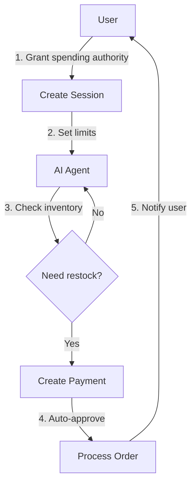

# AI Shopping Bot

Build an AI agent that can autonomously make purchases on behalf of users.

:::info
**This is an advanced use case** that uses ZendFi's AI-ready features. For traditional e-commerce, see the [E-commerce Store guide](./ecommerce-store.md).
:::

## What You'll Build

- AI agent with spending permissions
- Session-based spending limits
- User-approved autonomous purchases
- Real-time purchase notifications
- Automatic order fulfillment

## Real-World Example

**Scenario:** A user wants an AI assistant to automatically restock their favorite snacks when inventory runs low, without asking each time.

```
User: "Keep my pantry stocked with coffee. Budget: $50/month, max $15 per order."
AI: "Got it! I'll monitor your coffee inventory and reorder when needed."

[2 weeks later, AI detects low inventory]
AI: *Autonomously purchases 2lb coffee bag for $14.99*
User: *Receives notification* "✅ Coffee restocked. $14.99 charged."
```


## Step 1: Understanding the Flow




## Step 2: Grant AI Spending Permission

First, the user grants the AI agent permission to spend on their behalf:

```typescript
// app/api/ai/create-session/route.ts
import { zendfi } from '@/lib/zendfi';
import { getServerSession } from 'next-auth';

export async function POST(request: Request) {
  const session = await getServerSession();
  if (!session?.user) {
    return Response.json({ error: 'Unauthorized' }, { status: 401 });
  }
  
  const { 
    agentId,
    maxPerTransaction, 
    maxPerDay,
    maxPerMonth,
    duration, // hours
  } = await request.json();
  
  // Create AI agent session with spending limits
  const agentSession = await zendfi.agent.sessions.create({
    userId: session.user.id,
    walletAddress: session.user.walletAddress,
    agentId,
    limits: {
      maxPerTransaction,
      maxPerDay,
      maxPerMonth,
    },
    duration, // Session expires after this many hours
    metadata: {
      user_email: session.user.email,
      created_via: 'shopping-bot-ui',
    },
  });
  
  // Store session ID in database for the AI to use
  await saveAgentSession({
    userId: session.user.id,
    sessionId: agentSession.id,
    agentId,
    limits: agentSession.limits,
    expiresAt: agentSession.expiresAt,
  });
  
  return Response.json({ 
    sessionId: agentSession.id,
    expiresAt: agentSession.expiresAt,
  });
}
```


## Step 3: User Interface for Granting Permission

```typescript
// components/AIShoppingSetup.tsx
'use client';

import { useState } from 'react';

export function AIShoppingSetup() {
  const [maxPerTransaction, setMaxPerTransaction] = useState(15);
  const [maxPerDay, setMaxPerDay] = useState(50);
  const [maxPerMonth, setMaxPerMonth] = useState(200);
  const [duration, setDuration] = useState(720); // 30 days
  
  async function handleEnable() {
    const res = await fetch('/api/ai/create-session', {
      method: 'POST',
      headers: { 'Content-Type': 'application/json' },
      body: JSON.stringify({
        agentId: 'shopping-bot-v1',
        maxPerTransaction,
        maxPerDay,
        maxPerMonth,
        duration,
      }),
    });
    
    const { sessionId, expiresAt } = await res.json();
    alert(`AI shopping enabled! Session expires: ${new Date(expiresAt).toLocaleDateString()}`);
  }
  
  return (
    <div className="ai-shopping-setup">
      <h2>🤖 Enable AI Shopping Assistant</h2>
      <p>Grant your AI assistant permission to make purchases on your behalf.</p>
      
      <div className="limits">
        <label>
          Max per transaction:
          <input
            type="number"
            value={maxPerTransaction}
            onChange={(e) => setMaxPerTransaction(Number(e.target.value))}
          />
        </label>
        
        <label>
          Max per day:
          <input
            type="number"
            value={maxPerDay}
            onChange={(e) => setMaxPerDay(Number(e.target.value))}
          />
        </label>
        
        <label>
          Max per month:
          <input
            type="number"
            value={maxPerMonth}
            onChange={(e) => setMaxPerMonth(Number(e.target.value))}
          />
        </label>
        
        <label>
          Session duration (days):
          <input
            type="number"
            value={duration / 24}
            onChange={(e) => setDuration(Number(e.target.value) * 24)}
          />
        </label>
      </div>
      
      <div className="safety-info">
        <h3>✅ Safety Features</h3>
        <ul>
          <li>Session expires automatically</li>
          <li>Strict spending limits enforced</li>
          <li>Real-time purchase notifications</li>
          <li>Revoke permission anytime</li>
        </ul>
      </div>
      
      <button onClick={handleEnable}>Enable AI Shopping</button>
    </div>
  );
}
```


## Step 4: AI Makes Autonomous Purchase

The AI agent can now make purchases without asking for approval each time:

```typescript
// AI agent code (runs on your server or AI platform)
import { ZendFi } from '@zendfi/sdk';

const zendfi = new ZendFi({
  apiKey: process.env.ZENDFI_AGENT_API_KEY, // Special agent API key
});

async function checkAndRestock(userId: string, productId: string) {
  // 1. Check inventory level (your business logic)
  const inventoryLevel = await checkInventory(userId, productId);
  
  if (inventoryLevel < RESTOCK_THRESHOLD) {
    // 2. Get product details
    const product = await getProduct(productId);
    
    // 3. Get user's AI session
    const session = await getUserAgentSession(userId);
    
    // 4. Create autonomous payment using session
    try {
      const payment = await zendfi.agent.payments.create({
        sessionId: session.id, // Uses session spending limits
        amount: product.price,
        description: `Auto-restock: ${product.name}`,
        metadata: {
          user_id: userId,
          product_id: product.id,
          product_name: product.name,
          autonomous: true,
          agent_decision: 'inventory-low',
        },
      });
      
      console.log(`✅ Autonomous purchase: ${payment.id}`);
      
      // 5. Notify user
      await notifyUser({
        userId,
        title: 'AI Purchase Complete',
        message: `Your AI assistant restocked ${product.name} for $${product.price}`,
        paymentId: payment.id,
      });
      
      return payment;
    } catch (error) {
      // Handle limit exceeded, expired session, etc.
      console.error('Autonomous payment failed:', error);
      
      // Ask user to renew session
      await notifyUser({
        userId,
        title: 'AI Session Expired',
        message: 'Please renew your AI shopping session to continue auto-restocking.',
      });
    }
  }
}

// Run this periodically (e.g., daily check)
setInterval(async () => {
  const users = await getUsersWithAIEnabled();
  for (const user of users) {
    await checkAndRestock(user.id, user.favoriteProducts);
  }
}, 24 * 60 * 60 * 1000); // Daily
```


## Step 5: Process AI Purchases via Webhooks

```typescript
// app/api/webhooks/zendfi/route.ts
import { createNextWebhookHandler } from '@zendfi/sdk/nextjs';

export const POST = createNextWebhookHandler({
  secret: process.env.ZENDFI_WEBHOOK_SECRET!,
  handlers: {
    'agent.payment.confirmed': async (payment) => {
      // AI agent purchase confirmed
      console.log('AI autonomous purchase:', payment.id);
      
      // Fulfill order automatically
      await fulfillOrder({
        userId: payment.metadata.user_id,
        productId: payment.metadata.product_id,
        paymentId: payment.id,
        autonomous: true,
      });
      
      // Send notification to user
      await sendPushNotification({
        userId: payment.metadata.user_id,
        title: '🤖 AI Purchase Complete',
        body: `${payment.metadata.product_name} ordered for $${payment.amount}`,
        link: `/orders/${payment.id}`,
      });
      
      // Send email receipt
      await sendEmailReceipt({
        to: payment.metadata.user_email,
        orderDetails: {
          product: payment.metadata.product_name,
          amount: payment.amount,
          autonomous: true,
        },
      });
    },
    
    'agent.session.limit_exceeded': async (session) => {
      // AI tried to spend beyond limits
      await notifyUser({
        userId: session.metadata.user_id,
        title: '⚠️ AI Spending Limit Reached',
        message: `Your AI assistant hit the ${session.limitType} spending limit. Increase limits or wait for reset.`,
      });
    },
    
    'agent.session.expired': async (session) => {
      // Session expired
      await notifyUser({
        userId: session.metadata.user_id,
        title: '🔒 AI Session Expired',
        message: 'Your AI shopping session expired. Enable it again to continue auto-restocking.',
      });
    },
  },
});
```


## Step 6: User Dashboard

Show users their AI's spending activity:

```typescript
// app/dashboard/ai-spending/page.tsx
import { getAISpendingHistory, getActiveSession } from '@/lib/ai';

export default async function AISpendingPage() {
  const session = await getActiveSession();
  const history = await getAISpendingHistory();
  
  return (
    <div className="ai-spending-dashboard">
      <h1>🤖 AI Shopping Assistant</h1>
      
      {/* Current Session */}
      <div className="session-info">
        <h2>Active Session</h2>
        {session ? (
          <>
            <p>Status: ✅ Active</p>
            <p>Expires: {new Date(session.expiresAt).toLocaleDateString()}</p>
            <div className="limits">
              <div>Per Transaction: ${session.limits.maxPerTransaction}</div>
              <div>Daily: ${session.spent.today} / ${session.limits.maxPerDay}</div>
              <div>Monthly: ${session.spent.thisMonth} / ${session.limits.maxPerMonth}</div>
            </div>
            <button onClick={revokeSession}>Revoke Access</button>
          </>
        ) : (
          <>
            <p>Status: ❌ Inactive</p>
            <button onClick={() => window.location.href = '/setup-ai'}>
              Enable AI Shopping
            </button>
          </>
        )}
      </div>
      
      {/* Spending History */}
      <div className="spending-history">
        <h2>Purchase History</h2>
        {history.map((purchase) => (
          <div key={purchase.id} className="purchase-card">
            <span className="icon">🤖</span>
            <div className="details">
              <strong>{purchase.productName}</strong>
              <span>${purchase.amount}</span>
              <span>{new Date(purchase.createdAt).toLocaleDateString()}</span>
              <span className="autonomous-badge">Autonomous</span>
            </div>
            <a href={`/orders/${purchase.id}`}>View Order</a>
          </div>
        ))}
      </div>
    </div>
  );
}
```


## Advanced: Approval Flow (Optional)

For high-value purchases, require user approval:

```typescript
// AI agent checks if approval needed
async function createPurchaseIntent(userId: string, product: any) {
  const session = await getUserAgentSession(userId);
  
  // If over threshold, require approval
  if (product.price > session.limits.maxPerTransaction) {
    // Create payment intent (not auto-confirmed)
    const intent = await zendfi.agent.intents.create({
      sessionId: session.id,
      amount: product.price,
      description: `Approval needed: ${product.name}`,
      requiresApproval: true,
      metadata: {
        user_id: userId,
        product_id: product.id,
      },
    });
    
    // Notify user to approve
    await notifyUser({
      userId,
      title: '⚠️ AI Purchase Approval Needed',
      message: `Your AI wants to buy ${product.name} for $${product.price}. Approve?`,
      actions: [
        { label: 'Approve', action: `/approve/${intent.id}` },
        { label: 'Deny', action: `/deny/${intent.id}` },
      ],
    });
    
    return intent;
  }
  
  // Under threshold - proceed autonomously
  return await createAutonomousPayment(session, product);
}
```


## Security Best Practices

1. **Always set spending limits**
   - Per-transaction maximum
   - Daily spending cap
   - Monthly budget limit

2. **Use session expiration**
   - Don't create infinite sessions
   - Require periodic re-authorization

3. **Notify users immediately**
   - Push notifications for purchases
   - Email receipts
   - SMS for high-value items

4. **Audit trail**
   - Log all AI decisions
   - Track spending patterns
   - Alert on unusual behavior

5. **Easy revocation**
   - One-click disable
   - Immediate effect
   - Clear confirmation


## Testing

```bash
# Create AI agent API key
zendfi ai keys create --name "Shopping Bot"

# Create test session
zendfi ai sessions create \
  --wallet <address> \
  --max-per-day 50 \
  --max-per-transaction 15 \
  --duration 24

# Test autonomous payment
zendfi ai payment create \
  --session <session-id> \
  --amount 14.99 \
  --description "AI test purchase"

# Check session status
zendfi ai sessions status <session-id>
```


## Production Checklist

- [ ] Implement spending limits UI
- [ ] Set up real-time notifications (push + email)
- [ ] Add session renewal flow
- [ ] Implement audit logging
- [ ] Test session expiration behavior
- [ ] Add emergency revocation button
- [ ] Monitor for unusual spending patterns
- [ ] Implement approval flow for high-value items
- [ ] Test across different user scenarios


## Learn More

- [AI Payments Overview](../agentic/index.md)
- [Why AI Payments?](../agentic/why-ai-payments.md)
- [Agent Keys](../agentic/agent-keys.md)
- [Payment Intents](../agentic/payment-intents.md)
- [Security Best Practices](../agentic/security.md)


## Need Help?

- [Join Discord](https://discord.gg/zendfi)
- [Email support](mailto:support@zendfi.tech)
- [Book a demo](https://zendfi.tech/demo)
